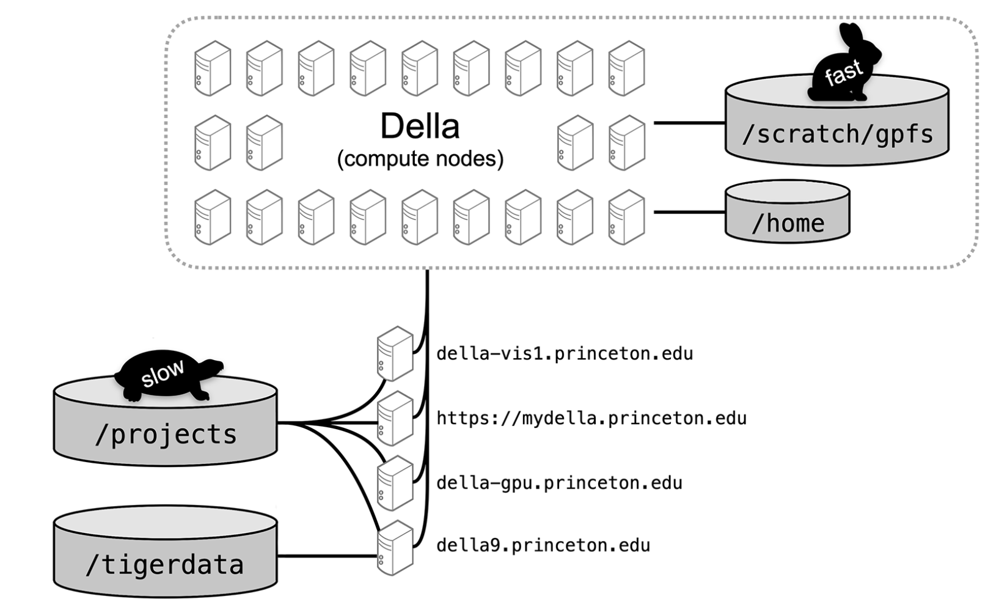

# Della Cluster Manual

## Overview
This manual is a guide for using the Della cluster at Princeton University.

Della is a general-purpose high-performance computing cluster designed for running serial and parallel production jobs. 
The cluster features both CPU and GPU nodes, with 356 A100 GPUs, and 336 H100 GPUs available if granted access to the PLI partition. For detailed cluster specifications, visit the [official website](https://researchcomputing.princeton.edu/systems/della).


## Table of Contents

- [Della Cluster Manual](#della-cluster-manual)
  - [Overview](#overview)
  - [Table of Contents](#table-of-contents)
  - [Getting Started](#getting-started)
  - [Connect to the Cluster](#connect-to-the-cluster)
    - [Option 1: SSH Command Line](#option-1-ssh-command-line)
      - [Setup SSH Key](#setup-ssh-key)
      - [Config SSH](#config-ssh)
    - [Option 2: Code Editor](#option-2-code-editor)
    - [Option 3: MyDella Web Portal](#option-3-mydella-web-portal)
  - [How to Use](#how-to-use)
  - [Hardware Configuration](#hardware-configuration)
  - [Compute Node](#compute-node)
    - [SLURM](#slurm)
  - [Storage](#storage)
  - [Useful Commands](#useful-commands)
  - [Reference](#reference)
  - [Comments](#comments)

## Getting Started

<!-- ### Request Access -->

To connect to Della, users must have either a Princeton account or a [Research Computer User (RCU) account](https://princeton.service-now.com/service/?id=sc_cat_item&sys_id=1ad90d40db80409072d3f482ba96192f) (for external collaborators) with a net ID. 

Access from your account to Della is granted through brief [faculty-sponsored proposals](https://researchcomputing.princeton.edu/get-started/get-account#large_clusters). Since our research group already has an approved project on Della, please contact Zhuang to sponsor your access by submitting a request to [cses@princeton.edu](mailto:cses@princeton.edu). 

## Connect to the Cluster
Once you have been granted access to Della, you can connect using an SSH client.

**Note**: VPN is required when accessing the cluster from off-campus. The recommended option is [GlobalProtect VPN](https://princeton.service-now.com/service?sys_id=KB0012373&id=kb_article), which can be downloaded [here](https://vpn.princeton.edu/). VPN is not required when connected directly to campus wifi ([eduroam](https://princeton.service-now.com/service?id=kb_article&sys_id=2c5368d84f3b22001961f7e18110c74d)).

### Option 1: SSH Command Line

For CPU or GPU jobs using the Springdale Linux 8 operating system:

```bash
ssh <YourNetID>@della.princeton.edu
```

For GPU-specific access:

```bash
ssh <YourNetID>@della-gpu.princeton.edu
```

For more information on SSH, see the [SSH FAQ](https://princeton.service-now.com/service?id=kb_article&sys_id=f52a27064f9ca20018ddd48e5210c72d). If you have trouble connecting, refer to Della's [SSH documentation](https://researchcomputing.princeton.edu/ssh).

#### Setup SSH Key

SSH keys provide secure, passwordless authentication to the cluster. Instead of typing your password each time, you can use SSH keys use cryptographic authentication with a public/private key pair.

_Generate SSH key pair on your local machine:_
```bash
# Generate Ed25519 key pair
ssh-keygen -t ed25519 -f ~/.ssh/della_ed25519 -C "<YourNetID>@princeton.edu"

# Set proper permissions
chmod 700 ~/.ssh
chmod 600 ~/.ssh/della_ed25519
chmod 644 ~/.ssh/della_ed25519.pub
```
This creates two files: a private key (`della_ed25519`) and a public key (`della_ed25519.pub`).

_Copy public key to Della_
```bash
# Option 1: Automatic copy (recommended)
ssh-copy-id -i ~/.ssh/della_ed25519.pub <YourNetID>@della.princeton.edu

# Option 2: Manual copy
cat ~/.ssh/della_ed25519.pub | ssh <YourNetID>@della.princeton.edu "mkdir -p ~/.ssh && cat >> ~/.ssh/authorized_keys"

# Set proper permissions on the cluster
ssh <YourNetID>@della.princeton.edu "chmod 700 ~/.ssh && chmod 600 ~/.ssh/authorized_keys"
```

_Connect using SSH key:_
Once set up, you can connect without entering your password:
```bash
ssh -i ~/.ssh/della_ed25519 <YourNetID>@della.princeton.edu
```

#### Config SSH

You can create an SSH config file to simplify connections and avoid typing the full hostname each time.

_Create or edit SSH config file:_
```bash
nano ~/.ssh/config
```

_Add configuration for Della:_
```bash
Host della
  HostName della.princeton.edu   # or della-gpu.princeton.edu
  User <YourNetID>
```

_If you have created SSH keys in previous step, add:_
```bash
  IdentityFile ~/.ssh/della_ed25519
  IdentitiesOnly yes
```

_Connect using the alias:_
Once configured, you can connect simply with:
```bash
ssh della
```


### Option 2: Code Editor

After you have configured SSH (see [Config SSH](#config-ssh) section), you can use VSCode/Cursor or other editors with Remote-SSH extension to develop directly on the cluster.

_Prerequisites:_
- Install the [Remote-SSH extension](https://marketplace.visualstudio.com/items?itemName=ms-vscode-remote.remote-ssh) in VSCode
- Complete SSH configuration from the previous section

**Connect to Della:**

_Method 1: Command Palette_
1. Open the Command Palette with `Ctrl+Shift+P` (or `Cmd+Shift+P` on Mac)
2. Type `Remote-SSH: Connect to Host` and press Enter
3. Select `della` from the list
4. VSCode will open a new window connected to Della

_Method 2: Remote Explorer_
1. Click the Remote Explorer icon in the left sidebar (or the remote connection button  in the bottom-left corner)
2. Select `Connect to Host` 
3. Choose `della` from the dropdown

_Authentication:_
- If you set up SSH keys in the [Setup SSH Key](#setup-ssh-key) section, you'll connect automatically
- Otherwise, you'll be prompted to enter your NetID password

Once connected, open a directory using the `Open Folder` button to start working on your project.

You can now edit files, run terminals, and develop as if working locally while actually using Della's computational resources.

_Troubleshooting:_ If you're on a Windows machine and cannot connect using VSCode, add the following to your SSH config:
```bash
    # Workaround for connection issues on Windows
    Ciphers aes128-ctr,aes256-ctr
    MACs hmac-sha2-256,hmac-sha2-512
    KexAlgorithms curve25519-sha256
    HostKeyAlgorithms ssh-ed25519,rsa-sha2-256,rsa-sha2-512
    Compression no
    IPQoS none
```


### Option 3: MyDella Web Portal

MyDella provides web-based access to the cluster, including both graphical interfaces and shell access:

```
https://mydella.princeton.edu
```

MyDella enables easy file transfers and supports interactive applications including [RStudio](https://researchcomputing.princeton.edu/support/knowledge-base/rrstudio), [Jupyter](https://researchcomputing.princeton.edu/support/knowledge-base/jupyter), [Stata](https://researchcomputing.princeton.edu/support/knowledge-base/stata), and [MATLAB](https://researchcomputing.princeton.edu/support/knowledge-base/matlab).

For visualization work or applications requiring graphical user interfaces (GUIs), use Della's [visualization nodes](https://researchcomputing.princeton.edu/systems/della#vis-nodes): Navigate to `https://mydella.princeton.edu` → Interactive Apps → Desktop on Della Vis Nodes.

## How to Use  

Since Della is a Linux system, basic Linux command knowledge is essential. For an introduction to Linux navigation, see the [Intro to Linux Command Line workshop](https://github.com/gabeclass/introcmdline) materials.

After logging in, you will land on a login node (`della8` or `della-gpu` depending on your connection choice). Login nodes are for lightweight tasks like file management, code editing, and job submission. For computational work, you must use compute nodes (see [Compute Node](#compute-node) section).


**Important Guidelines:**
The login nodes, `della8` and `della-gpu`, should be used for interactive work only, such as compiling programs and submitting jobs as described below. **No jobs should be run on the login node**, other than brief tests that last no more than a few minutes and only use a few CPU-cores.

**Visualization Nodes:** the Della cluster has two dedicated nodes for visualization and post-processing tasks, called `della-vis1` and `della-vis2`, which can be connected via
```bash
# della-vsi1: 80 CPU-cores, 1 TB of memory, 1 40GB A100 GPU with  of memory.
ssh <YourNetID>@della-vis1.princeton.edu
# della-vsi2: 28 CPU-cores, 256 GB of memory, four 16 GB P100 GPUs.
ssh <YourNetID>@della-vis2.princeton.edu
```
Note that there is no job scheduler on `della-vis1` or `della-vis2`. In addition to visualization, the nodes can be used for tasks that are incompatible with the Slurm job scheduler, or for work that is not appropriate for the Della `login` nodes (such as downloading large amounts of data from the internet).

## Hardware Configuration

Della is composed of both CPU and GPU nodes:

| Partition | Processor | Nodes | Cores per Node | CPU Memory per Node | Max Instruction Set | GPUs per Node |
|-----------|-----------|-------|----------------|---------------------|---------------------|---------------|
| cpu | 2.4 GHz AMD EPYC 9654 | 55 | 192 | 1500 GB | AVX-512 (2 cycles) | N/A |
| cpu | 2.8 GHz Intel Cascade Lake | 64 | 32 | 190 GB | AVX-512 | N/A |
| cpu | 3.1 GHz Intel Cascade Lake | 24 | 40 | 380 GB | AVX-512 | N/A |
| gpu | 2.6 GHz AMD EPYC Rome | 20 | 128 | 768 GB | AVX2 | 2 (A100) |
| gpu | 2.8 GHz Intel Ice Lake | 59 | 48 | 1000 GB | AVX-512 | 4 (A100) |
| gpu | 2.8 GHz Intel Ice Lake | 10 | 48 | 1000 GB | AVX-512 | 8 (MIG A100) |
| gpu | 2.8 GHz Intel Ice Lake | 2 | 48 | 1000 GB | AVX-512 | 28 (MIG A100) |
| pli | 2.8 ARM Neoverse-V2 | 1 | 72 | 575 GB | -- | 1 (GH200)* |
| pli | 2.1 GHz Intel Sapphire Rapids | 42 | 96 | 1000 GB | AVX-512 | 8 (H100)** |

Each GPU has either 10 GB, 40 GB or 80 GB of memory. The nodes of Della are connected with FDR Infiniband.

You can check the current system status on `https://mydella.princeton.edu` → (`Files` / `Jobs` / `Cluster`). You can also the `shownodes` command in a terminal for additional information about the nodes.


## Compute Node

### SLURM

SLURM (Simple Linux Utility for Resource Management) is the job scheduler used on Della to manage computational resources. All compute jobs must be submitted through SLURM rather than running directly on login nodes.

_Basic SLURM Commands:_

**Check available resources:**
```bash
sinfo                    # Show all partition and node information
sinfo -N -p <Partition>  # Show node status of a given partition
squeue                   # Show running and pending jobs
squeue --m               # Show only your jobs
```

**Submit jobs:**
```bash
sbatch job_script.slurm  # Submit a batch job
srun <command>           # Run interactive job
salloc                   # Allocate resources for interactive session
```

**Monitor and manage jobs:**
```bash
scontrol show job <JobID>  # Show detailed job information
scancel <JobID>            # Cancel a job
sacct -j <JobID>           # Show job accounting information
```

_Basic Job Script Example:_
```bash
#!/bin/bash
#SBATCH --job-name=my_job        # Job name
#SBATCH --partition=cpu          # Partition (cpu, gpu, pli)
#SBATCH --nodes=1                # Number of nodes
#SBATCH --ntasks=1               # Number of tasks
#SBATCH --cpus-per-task=4        # CPU cores per task
#SBATCH --mem=8G                 # Memory per node
#SBATCH --time=01:00:00          # Time limit (hh:mm:ss)
#SBATCH --output=output_%j.log   # Output file (%j = job ID)

# Your commands here
echo "Job started on $(date)"
python my_script.py
echo "Job completed on $(date)"
```


## Storage

Here is a schematic diagram below shows the filesystems that are available on Della:


The storage space you have access to are:

- **`/home/<YourNetID>`**
  - 50GB per user.
  - The /home directory of a user is for source code, executables, Conda environments, R packages, Julia packages, and small data sets.
  - The /home directory of each user is backed up with the exception of the `.conda`, `.cache` and `.vscode` directories.

- **`/scratch/gpfs/<YourNetID>`**
  - 1TB per user.
  - The `/scratch/gpfs directory` of a user is for job input and output files, and for storing intermediate results.
  - The `/scratch/gpfs` filesystem is a fast, parallel filesystem that is local to each cluster which makes it ideal for storing job input and output files. However, because **`/scratch/gpfs` is not backed up** you will need to transfer your completed (non-volatile), job files to `/projects` or `/tigerdata` for long-term storage. The files belonging to a user in `/scratch/gpfs` are not purged until many months after the user has left the university. Write to [cses@princeton.edu](mailto:cses@princeton.edu) for questions about purging. 

- **`/scratch/gpfs/ZHUANGL`**
  - 15TB shared among the group.
  - Same functionality as individual scratch space but shared across the lab.
  - Please create your personal directory at `/scratch/gpfs/ZHUANGL/<YourNetID>`.

- **`/tmp`** (not shown in the figure) 
  - This is local scratch space that exists on each compute node for high-speed reads and writes. If file I/O is a bottleneck in your code or if you need to store temporary data then you should consider using this.

**Important:** all compute nodes do not have Internet access. Because of this, a running job cannot download files, install packages or connect to GitHub. You will need to perform these operations on the `login` node or a `visualization` node (see [visualization node usage](#how-to-use) section above), which has internet connection, before submitting the job.

**Note:** we are currently requesting [additional storage](https://tigerdata.princeton.edu/) space at `/tigerdata`. More information will be updated here upon request approval.

## Useful Commands

- **`shownodes`** - Display current status and availability of compute nodes
- **`checkquota`** - Check your storage quota usage for home and scratch directories
- **`jobstats <JobID>`** - Check the status and node usage of a running job.

## Reference

## Comments
For any questions regarding the setup or usage of the Della cluster, please contact Taiming Lu via [email](mailto:tl0463@princeton.edu) or through [Messenger](http://facebook.com/taiminglu).


